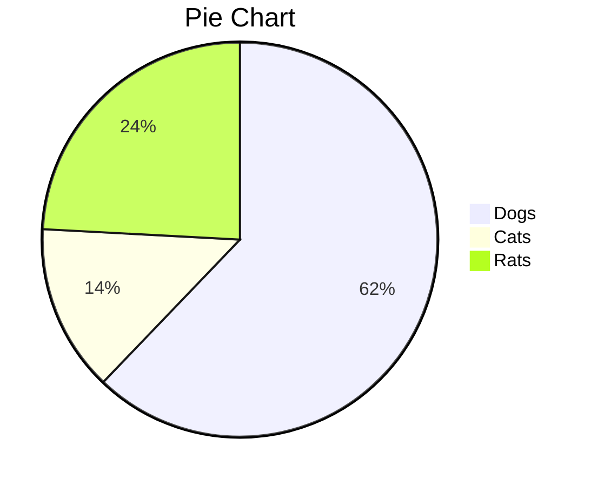

[toc]

# 一级标题

## 二级标题

### 三级标题

#### 四级标题

##### 五级标题

###### 六级标题

> 这是一句引言

- 常规：==文本高亮==，__加粗__，*斜体italics*，==***斜体高亮加粗***==，~~删除线~~，<u>下划线</u>。
- 标签：<font>默认小标签</font>、<font style="background-color:#8bc34a">绿色小标签</font>、<font title="blue">蓝色小标签</font>、<font title="yellow">黄色小标签</font>、<font title="gray">灰色小标签</font>。

- 强调：<span alt="underline">下划线</span>、<span alt="emp">着重号</span>、<span alt="wavy">波浪线</span>。
- 特效：<span alt="blink">字体闪烁</span>、<span alt="rainbow">彩虹变换字体特效</span>、<span alt="shake">抖音字效</span>

行内公式：$\lim\limits_{x \to \infty} \exp(-x)=0$，行间公式：
$$
E_0 = mc^2 \\
\quad\text{—— Albert Einstein}
$$

推荐：[latex手写公式识别](http://draw.mathpix.com/)

1. 有序列表[^1]
   - 无序列表
   - 无序列表
2. 有序列表

| 表头1  | 表头2 | 表头3 |
| ------ | ----- | ----- |
| Typora | Piex  | Theme |

代码：`show me the code`

```python
def decorator(func):
    def wrapper(*args, **kwargs):
        ...
        return func(*args, **kwargs)
    return wrapper
```

```diff
+ 新增行
- 删除行
其他行
```

<details>
    <summary>折叠标签</summary>
    <p>PDF文件预览示例（<code>https://zhixingo.github.io/plays/pdfv/?url=PDF文件链接</code>）：</p>
    <iframe src="https://zhixingo.github.io/plays/pdfv/?url=https://files.catbox.moe/5iz1r9.pdf" height="400" frameborder="0" scrolling="no"></iframe>
</details>



时间轴（Volantis）：

<div alt="timeline">
    <div alt="timenode">
        <div alt="meta">2019.9 ~ 2022.6 <a href="#">家里蹲B</a></div>
        <div alt="body">
            人言落日是天涯，望极天涯不见家。
            已恨碧山相阻隔，碧山还被暮云遮。
        </div>
    </div>
    <div alt="timenode">
        <div alt="meta">2015.9 ~ 2019.6 <a href="#">家里蹲A</a></div>
        <div alt="body">
            看花开花落，谈笑风生...
        </div>
    </div>
</div>

任务列表：

- [x] 未完成任务1
- [x] 未完成任务2
- [ ] 已完成任务1
- [ ] 已完成任务2

[^1 ]: 以上样式借鉴[muggledy/typora-dyzj-theme](https://github.com/muggledy/typora-dyzj-theme)、[kevinzhao2233/typora-theme-pie](https://github.com/kevinzhao2233/typora-theme-pie)，万分感谢！